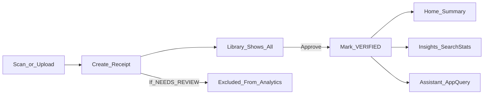

## Architecture (current)

### Repo layout

- `frontend/`: Expo app (expo-router)
- `backend/`: Express API + Prisma
- `docs/`: human docs (this folder)

### Frontend (Expo)

Key entry points:

- `frontend/app/`: screens (tabs + modals)
- `frontend/src/api/client.ts`: **all API calls**
- `frontend/src/store/useStore.ts`: Zustand store (user, theme, basket, refreshKey)

Primary screens:

- `frontend/app/(tabs)/index.tsx`: Home (summary + categories + recent)
- `frontend/app/(tabs)/scan.tsx`: Scan entry (scanner + library)
- `frontend/app/modal/library.tsx`: Library (receipt list + approve + split/share)
- `frontend/app/(tabs)/insights.tsx`: Insights (VERIFIED-only analytics snapshot)
- `frontend/app/(tabs)/assistant.tsx`: Assistant (chat + basket + data-backed quick chips)
- `frontend/app/(tabs)/shared.tsx`: Shared (groups + household card)

### Backend (Express)

- `backend/src/index.ts`: server + route mounting
- `backend/src/middlewares/auth.ts`: Firebase token verification (`requireAuth`)
- `backend/prisma/schema.prisma`: data models

Important domains:

- Receipts: `backend/src/routes/receipts.ts`
- Analytics: `backend/src/routes/transactions.ts`
- Deterministic “app-query” answers: `backend/src/services/appQueryService.ts`
- AI chat route (currently deterministic fallback): `backend/src/routes/ai.ts`
- Household dashboard: `backend/src/routes/household.ts`

### Trust rules (non-negotiable)

- **`Receipt.status` gating**:
  - `VERIFIED` receipts affect totals, Insights, and app-query aggregates
  - `NEEDS_REVIEW` receipts are visible in Library but excluded from analytics until approved

### Data flow (high-level)

