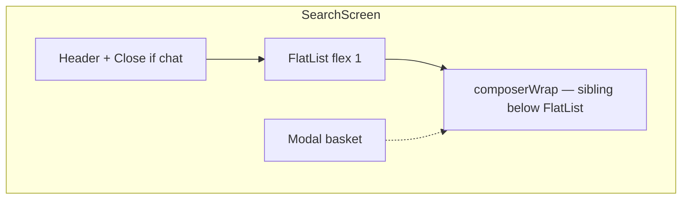

# Search tab — feature map, architecture, and debugging

This document describes the **Search** tab in SmartBudgetAI: what it does, how it is wired, and where to look when something breaks. **Source of truth** is the code under `frontend/` and `backend/`; update this file when behavior changes materially.

---

## 1. What the Search tab is for

- **Snapshot-first empty state:** metrics via `GET /api/transactions/search-stats` (most visited store, top category, last 30 days avg from **VERIFIED** receipts, community weighted average).
- **Chat with two engines (user-selectable):**
  - **Data** — `POST /api/app-query` (receipt-grounded intents over VERIFIED data).
  - **General** — `POST /api/ai/chat` via `askSmartBudget` in the API client (broader assistant replies).
- **On-device persistence:** last conversation and selected engine are saved with AsyncStorage (`frontend/src/features/search/searchStorage.ts`); restored on app launch.
- **Shopping basket** in global Zustand; manual add in a modal; **multi-item lists** via chat (heuristic `looksLikeBasketList` in `searchUtils.ts`).
- **Basket finalize** — `POST /api/basket/insights` (`getBasketInsights`).

---

## 2. User-visible features

| Feature | Behavior |
|--------|----------|
| **Your snapshot** | Shown in `FlatList` **header** when there are **no messages** and keyboard is **not** open (see below for keyboard). Four stat rows. |
| **Try asking** | Three preset prompts. Rendered **inside** the same list header under “Your snapshot” when empty; **also** as `ListFooterComponent` when there are messages **and** keyboard is closed. **Hidden** when `keyboardOpen`; keyboard opens → header shows “Conversation” only. |
| **Engine toggle** | **Data** / **General** chips above the composer row; routes `send()` to `appQuery` or `askSmartBudget`. |
| **Composer** | `[Basket] [text field] [Send]` — basket opens modal; send runs `send()`. Multiline input grows up to ~5 lines then scrolls internally. |
| **Close** | Clears **messages**; persistence saves an **empty** thread (same storage key). Does **not** clear basket. Shown when `messages.length > 0`. |
| **Chat send** | Appends user message; if `looksLikeBasketList` → merge basket + `basket_cta` (no API chat). Else → Data or General API per toggle. |
| **Finalize** | From assistant `basket_cta` row or basket modal |

---

## 3. UI layout (React Native)

**Screen:** [`frontend/app/(tabs)/search.tsx`](frontend/app/(tabs)/search.tsx)

**Helpers / persistence:** [`frontend/src/features/search/searchUtils.ts`](frontend/src/features/search/searchUtils.ts), [`frontend/src/features/search/searchStorage.ts`](frontend/src/features/search/searchStorage.ts)

Top to bottom:

1. **Header** — “Search” + **Close** when `messages.length > 0`. Safe area padding.
2. **`FlatList`** (`flex: 1`)
   - **`ListHeaderComponent`:** If empty thread **and** not `keyboardOpen` → **Your snapshot** card + **Chat / Try asking** block. If `keyboardOpen` **or** messages exist → **Conversation** label only (when not showing full snapshot).
   - **`data`:** `messages`.
   - **`ListFooterComponent`:** “Try asking” duplicate prompts when `messages.length > 0` and not `keyboardOpen` (null otherwise).
   - **`contentContainerStyle`:** `flexGrow: 1` when messages exist; `paddingBottom` from measured composer + tab bar reserve + keyboard empty-state reserve.
3. **Basket modal** — `Modal` + `ScrollView`.
4. **`composerWrap`** — **Engine row** (Data / General) + **composer row** + padding for **floating tab bar** (`TAB_BAR_HEIGHT` + `tabBarBottom`).

**Keyboard:** `KeyboardAvoidingView` with iOS `padding` and computed `keyboardVerticalOffset`; tab layout uses `tabBarHideOnKeyboard` in [`frontend/app/(tabs)/_layout.tsx`](frontend/app/(tabs)/_layout.tsx).

`FlatList` and `composerWrap` (engine row + composer) are **siblings** inside `KeyboardAvoidingView`, not nested inside the list.

---

## 4. State and data flow

### Local state (`useState`)

| State | Role |
|-------|------|
| `messages` | Chat rows; empty ⇒ snapshot + prompts in header (when keyboard closed). |
| `chatEngine` | `"data"` \| `"general"`. |
| `searchHydrated` | After AsyncStorage load finishes; gates composer/engine until then; combined with a ref check so restored state never overwrites messages added while load was in flight. |
| `composer`, `running`, `keyboardOpen`, `composerInputHeight` | UI. |
| `searchStats` / loading / error | Snapshot API. |
| `composerAreaHeight`, `composerRowHeight` | List bottom padding. |

### Persistence

- **Key:** `smartbudget_search_chat_v1` (see `searchStorage.ts`).
- **Payload:** `{ messages, chatEngine }` (messages capped at 100).
- **Close** clears messages; the save effect persists `{ messages: [], chatEngine }` (empty conversation, key still present).

### Global store ([`frontend/src/store/useStore.ts`](frontend/src/store/useStore.ts))

| Field | Role |
|-------|------|
| `basket` | `string[]` (max 30 merged). |
| `refreshKey` | Search refetches `search-stats` on focus when this changes. |
| `user` / `idToken` | Auth. |

### Focus / refresh

- `useFocusEffect` → `loadSearchStats()`; deps include `refreshKey`.

---

## 5. API contracts (Search-related)

### `GET /api/transactions/search-stats`

- **Client:** `getSearchStats` → `SearchStatsResponse`.
- **Backend:** [`backend/src/routes/transactions.ts`](backend/src/routes/transactions.ts) — `GET /search-stats` before `/:id`.

### `POST /api/app-query` (Data engine)

- **Client:** `appQuery`.
- **Backend:** [`backend/src/routes/appQuery.ts`](backend/src/routes/appQuery.ts) → `runAppQuery`.

### `POST /api/ai/chat` (General engine)

- **Client:** `askSmartBudget`.
- **Backend:** route mounted in Express (see `backend/src/index.ts` for `/api/ai`).

### `POST /api/basket/insights`

- **Client:** `getBasketInsights`.

---

## 6. Chat logic (frontend)

### `send(text)`

1. Append user message; clear composer.
2. If `looksLikeBasketList` → merge basket + assistant `basket_cta`; **no** Data/General API.
3. Else if `chatEngine === "general"` → `askSmartBudget` → `cleanAnswer(r.reply)`.
4. Else → `appQuery` → `cleanAnswer(r.answer)`.

### `finalizeBasket()`

- `getBasketInsights({ itemNames: basket })`.

### `closeChat()`

- `setMessages([])`; scroll to top; persistence saves an empty thread.

---

## 7. File map

| Area | Path |
|------|------|
| Search screen | [`frontend/app/(tabs)/search.tsx`](frontend/app/(tabs)/search.tsx) |
| Utils + `ChatMessage` type | [`frontend/src/features/search/searchUtils.ts`](frontend/src/features/search/searchUtils.ts) |
| AsyncStorage | [`frontend/src/features/search/searchStorage.ts`](frontend/src/features/search/searchStorage.ts) |
| API client | [`frontend/src/api/client.ts`](frontend/src/api/client.ts) |
| App query service | [`backend/src/services/appQueryService.ts`](backend/src/services/appQueryService.ts) |
| Search stats | [`backend/src/routes/transactions.ts`](backend/src/routes/transactions.ts) |
| App query route | [`backend/src/routes/appQuery.ts`](backend/src/routes/appQuery.ts) |
| Basket insights | [`backend/src/routes/basket.ts`](backend/src/routes/basket.ts) |

---

## 8. Expo Go QA checklist (manual)

1. Open Search → snapshot loads; pull-to-refresh not required (focus reload).
2. Toggle **Data** / **General**; send a short message; assistant reply appears above composer and tab bar.
3. Paste multiline list (`Milk` + newline + `Bread`) → basket merge + CTA; no `appQuery`/`ai` chat for that path.
4. Open keyboard → prompts in header/footer hide; **Conversation** header path; scroll last message visible.
5. **Close** → thread empty, snapshot returns; reopen app → history restores unless you closed (then empty thread is stored).
6. Basket modal → add item → finalize → insights message.

**Expo Go testable:** yes (JS-only). **Native build** only if testing native-only modules.

---

## 9. Debugging checklist (symptom → layer)

| Symptom | Likely layer | What to check |
|---------|----------------|---------------|
| Snapshot wrong / empty | Backend / DB | VERIFIED receipts; `search-stats` handler. |
| Data vs General wrong | Frontend | `chatEngine` state; `send()` branch. |
| History not restoring | Frontend | `loadSearchChatState`, `searchHydrated`, AsyncStorage permissions. |
| General chat fails | Backend | `/api/ai/chat` route, env, errors in response. |
| Layout overlap | UI | `listContentPaddingBottom`, `composerAreaHeight`, `tabBarReserve`. |

---

## 10. Changelog pointer

When Search behavior changes, update this doc or [`docs/03_FEATURE_BEHAVIOR_SPEC.md`](docs/03_FEATURE_BEHAVIOR_SPEC.md) if that is the product spec of record.
